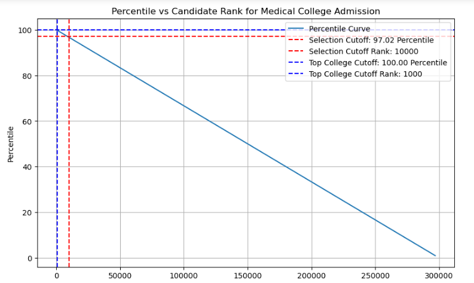

# Project8-STM-Selection-In-Medical-Colleges
> **Brief Description:** Three lacs candidates sat for entrence test. Only 10000 seats are available for admission. Out of these 1000 are in the top level medical colleges and rest will be absorbed by regional colleges.

---

## Table of Contents

- [Description](#description)
- [Video Explanation](#video)
- [Technologies Used](#technologies-used)
- [Dataset](#dataset)
- [Program Codes ](#program-codes)
- [Screenshots](#screenshots)
- [Contribution](#contributipn)
- [Contact Details](#contact-details)

---

## Description

Three lacs candidates sat for entrence test. Only 10000 seats are available for admission. Out of these 1000 are in the top level medical colleges and rest will be absorbed by regional colleges. This is a problem of calculation of percentile. This is because in actual data there may be many candidates getting same marks.

## Video
<!--
 
-->

We are working on this section. Please check at some other time.

## Technologies-used

Python programming language, pandas and matplotlib package.

## Dataset

The data set is synthetically generated and used for demonstrating the concept only. The program can be easily modified to show results with real readings taken from the patients.

## Program-codes

The programs are written on jupiter notebook, You may run the program on Google colab by clicking on the colab badge below.

## Screenshots

## Layman's Explanation of Percentile vs Candidate Rank for Medical College Admission

The program generates and plots a graph to illustrate the percentile distribution of candidates for medical college admission, highlighting the selection cutoffs for overall selection and top college seats. Here's what the plot communicates in layman's terms:

### Plot Overview:
1. **Percentile Curve**:
   - The curve shows how the percentile ranking changes as the rank of candidates increases.
   - It demonstrates the relationship between a candidate's rank and their percentile.

### Key Points:
1. **Percentile Curve**:
   - The x-axis represents the rank of the candidates (from 1 to 300,000).
   - The y-axis represents the percentile of the candidates.

2. **Selection Cutoff**:
   - The red dashed lines indicate the cutoff for overall selection.
   - The horizontal red line shows the minimum percentile required for selection.
   - The vertical red line shows the rank of the last candidate selected.

3. **Top College Cutoff**:
   - The blue dashed lines indicate the cutoff for top college seats.
   - The horizontal blue line shows the minimum percentile required for top college admission.
   - The vertical blue line shows the rank of the last candidate admitted to a top college.

### Interpretation:
- **Percentile vs Rank**:
  - The curve shows that as the rank increases (i.e., as we move to less successful candidates), the percentile decreases.
  - Candidates with higher ranks have higher percentiles, meaning they performed better.

- **Selection Cutoff**:
  - The selection cutoff indicates that only candidates above a certain percentile (and hence below a certain rank) are selected.
  - For example, if the cutoff is at the 96.67th percentile, it means candidates ranked 10,000 or better are selected.

- **Top College Cutoff**:
  - The top college cutoff indicates that only candidates with very high percentiles (and hence very high ranks) are admitted to top colleges.
  - For example, if the cutoff is at the 99.67th percentile, it means only the top 1,000 candidates are admitted to top colleges.

### In Layman's Terms:
The plot visually explains how medical college admissions are determined based on candidate rankings and percentiles. The graph shows:

- **Overall Selection**:
  - The red dashed lines indicate that candidates ranked up to 10,000 are selected. These candidates are in the top 96.67 percentiles.

- **Top College Admission**:
  - The blue dashed lines indicate that candidates ranked up to 1,000 are admitted to top colleges. These candidates are in the top 99.67 percentiles.

This plot helps to understand the competitive nature of medical college admissions, showing that only the top-performing candidates are selected and even fewer are admitted to the top colleges.

## Contribution

The programs are written by Santanu Karmakar

## Contact-details

If you wish to contact me, please leave a message (Preferably WhatsApp) on this number: 6291 894 897.
Please also mention why you are contacting me. Include your name and necessary details.
Thank you for taking an interest.

